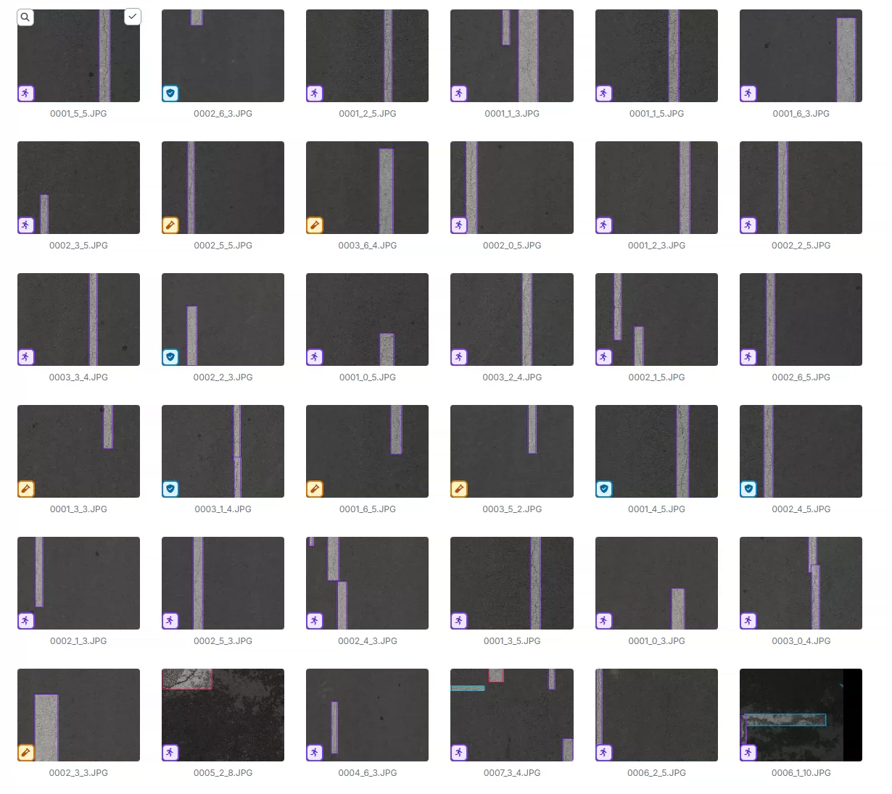
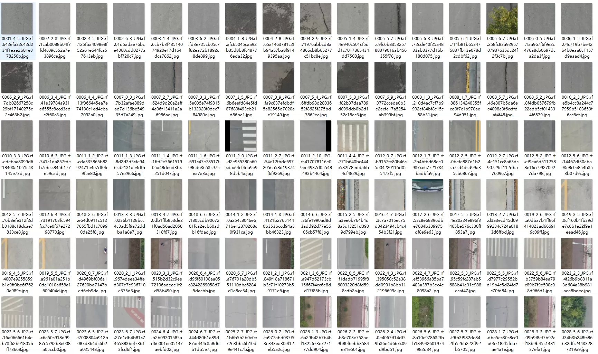
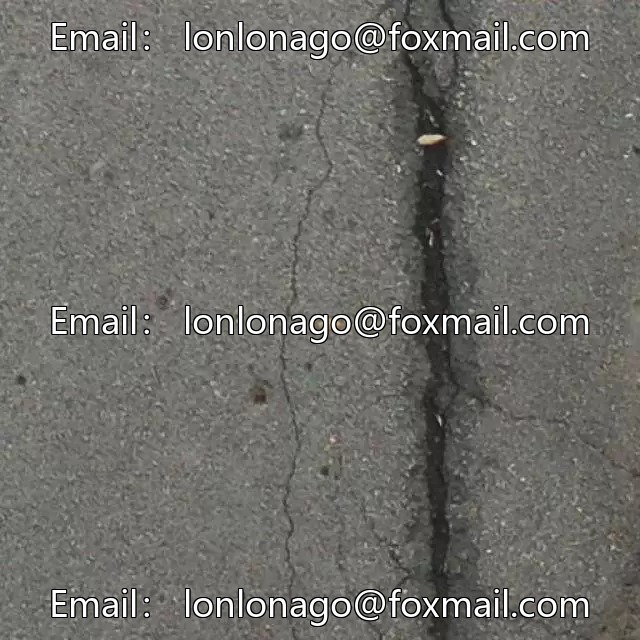
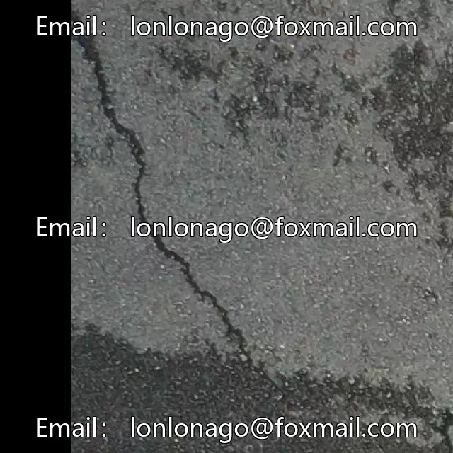
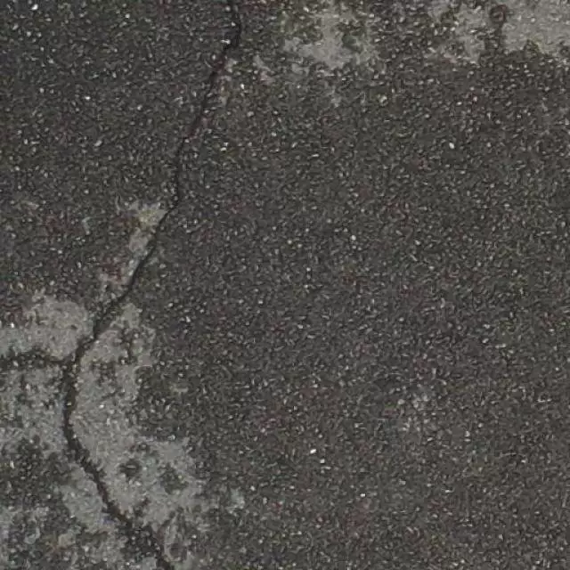
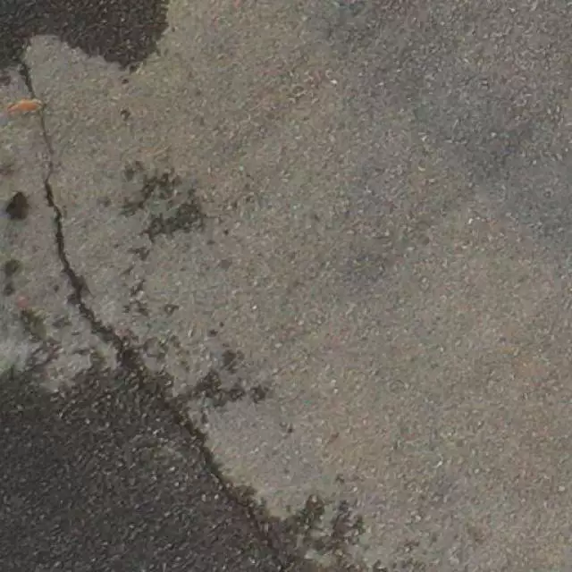

## Body

Road Crack Detection Dataset in YOLO format

Totally 6093 images, each labeled with a tag.
It is divided into 7 categories: 'Alligator crack', 'Block crack', 'Longitudinal crack', 'Oblique crack', 'Pothole', 'Repair', 'Transverse crack'
'Alligator crack', 'Block crack', 'Longitudinal crack', 'Oblique crack', 'Pothole', 'Repair', 'Transverse crack'

Electronic virtual products sold are not returnable.

## Images

Here is a pay link on Stripe ( https://buy.stripe.com/3cs8yP7sY87d0vu9AB ). Please contact me lonlonago@foxmail.com after funding $89, and I will send you a complete data files , thank you!

